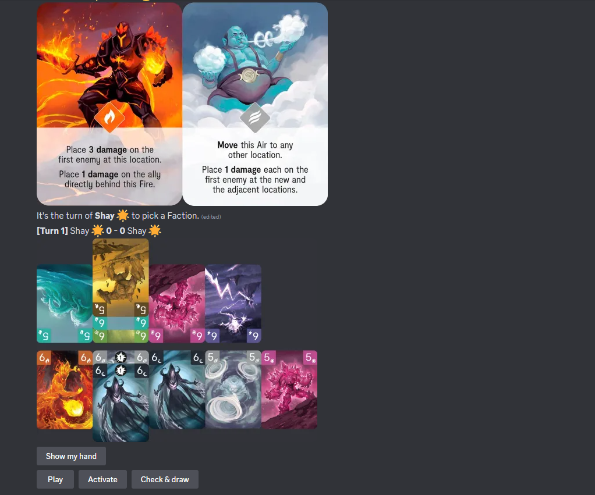

# Riftforce Discord bot

Discord bot that allows playing the 2-player mode of playing Riftforce. To learn to play Riftforce you can read [the Riftforce Rulebook](files/Rulebook.pdf) and after that, [the Riftforce Beyond Rulebook](files/Rulebook%20Expansion.pdf), which is Riftforce's expansion.



## Features

- All factions from Riftforce and Riftforce Beyond.
- Add custom factions.
- A working console version of the 2-player mode of Riftorce and Riftorce Beyond.
- A fully featured Discord bot that prevents illegal plays.

## How to use

First note that this repository does not contain illustrations. You will need to get these on your own and add them into `files/imgs/Original`. Refer to [Illustrations should go here.txt](files/imgs/Original/Illustrations%20should%20go%20here.txt) for instructions on the images.

1. Create your [own Discord bot](https://discord.com/developers/applications) and invite it to your server.
2. In the root folder, create a `.env` file,and write in it:
```
DISCORD_TOKEN = *your bot secret token*
DISCORD_GUILD_ID= 0
# Optionally you can use your server ID instead of 0. This will speed up syncing, but will duplicate the commands in your server.
```

3. Run `bot.py`. 
4. Write in a text-channel accesible by the bot the `/sync`.
5. After the commands have synced to your server, you should be able to play using the application command `/play`.
6. Let the second player click the button that will appear, and start playing.
  
## Create a custom faction

To create a custom faction you should:

- Create the corresponding illustrations and add them to `files/imgs/Original`.
- On `riftforce/Effect.py` create a class for the effect of your faction. You should be able to learn how to create them by looking at the rest of factions.
- On `riftforce/Card.py` assign to the `FACTION_EMOJI` dictionary an emoji to your new class. 
- On `riftforce/Card.py`, on `Card.getEffect()` add a new case to the match-case statment `case 'Name-of-your-faction': effect = Name_of_the_class`.
- On `commands/Views/EffectView.py`, add the name of your faction to where it belongs. 
  - Factions on `FACTIONS_WITH_NO_CUSTOM_EFFECT`, there are factions that will not need the player's input to know what to do (mainly factions that do not move).
  - Factions on `FACTIONS_THAT_MOVE` will ask the player a column to move. For example, Plant or Water. Add it to `FACTIONS_THAT_MOVE_ADJACENT` or `FACTIONS_THAT_MOVE_ANYWHERE` as well to determine whether this column is adjacent to the card or not.
  - Note that for more complex effects, code should be written. You can check the Light faction to see how to make a faction that can do an effect to anywhere in a side of the board, or Thunderbolt to do an effect anywhere on a column.
- Optionally, add messages to guide the player in `commands/Views/EffectView.py` on ``View.content()`` and in `commands/Views/MainView.py` on `MainView.activate_log()`.